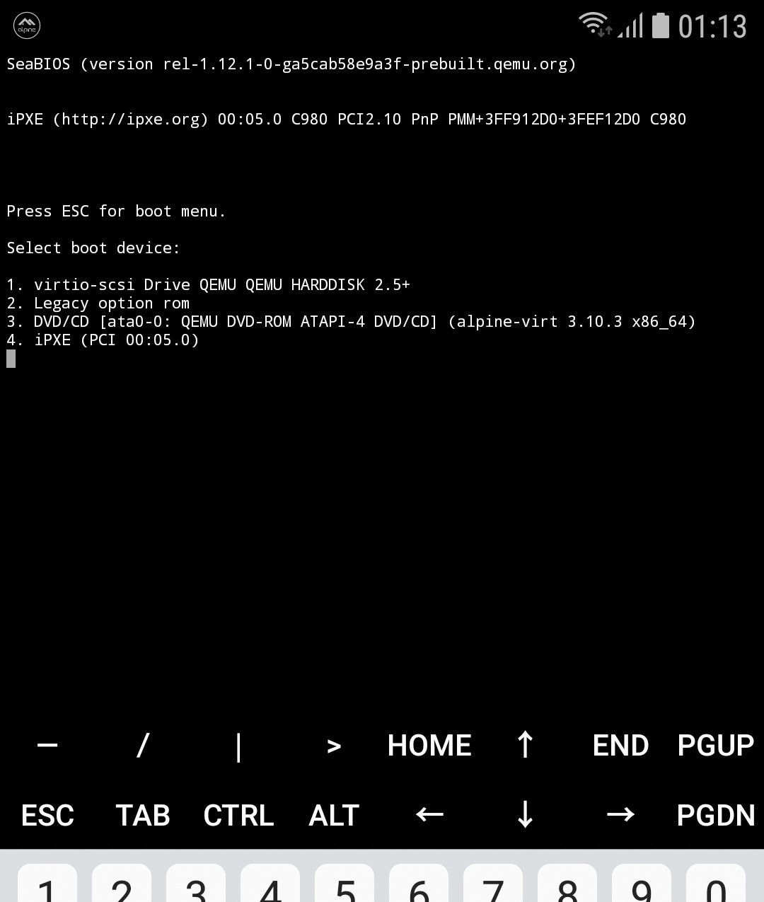

# Alpine Term

This is a terminal emulator and a Linux environment application using
the [QEMU](https://qemu.org) to run the [Alpine Linux](https://alpinelinux.org)
distribution.

*Inspired by [Termux](https://github.com/termux/termux-app) and
[UserLAnd](https://github.com/CypherpunkArmory/UserLAnd) applications.*

**Disclaimer**: by installing this software, you are agreeing to use it
on your own risk. Alpine Term comes with disk image file containing the
software developed by third-parties. [Author](https://github.com/xeffyr)
is not responsible for any damage that may affect your device or data.

## System requirements

In general, it should work on any high-end device which met the following
requirements:

 - AArch64 CPU.
 - Android 7.0 or higher.
 - At least 1 GB of space on the internal storage.

Note that application also works on x86 & x86_64 devices, however I tested
it only in Android emulators coming with SDK. ARM devices are completely
unsupported.

## Credits

Alpine Term relies on the source code of the following projects:

 - [Termux](https://github.com/termux/termux-app)
 - [QEMU](https://qemu.org)
 - [Socat](http://www.dest-unreach.org/socat/)
